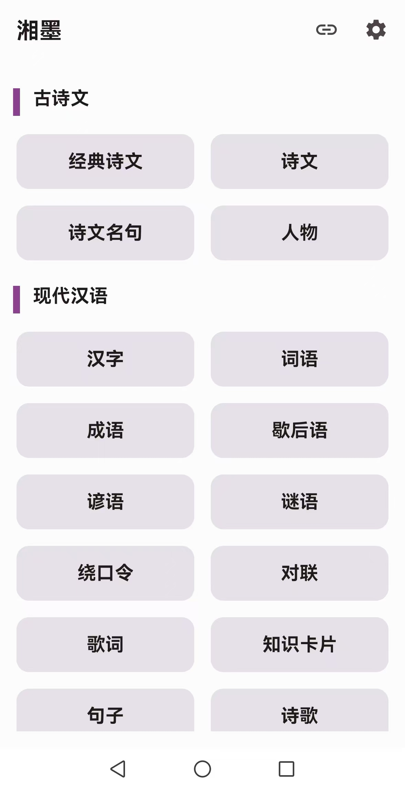
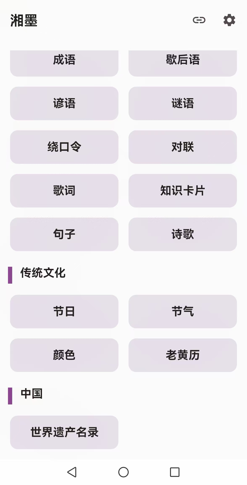
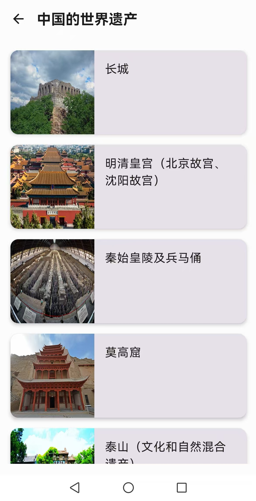
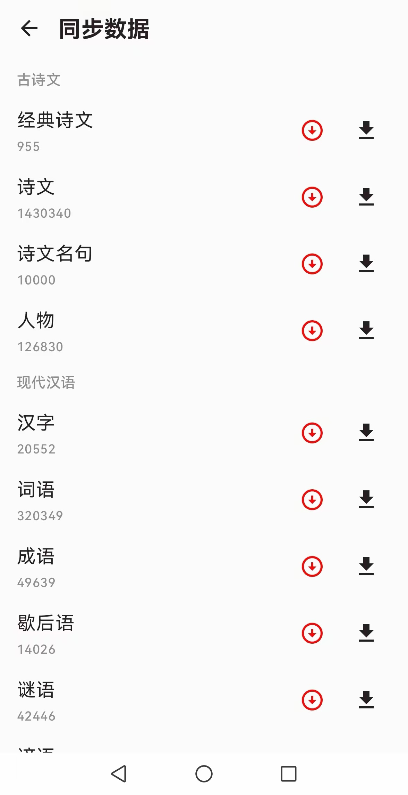

<div align="center">
<div align="center">
</div>
    
# 湘墨
    

</div>

## 预览

<p align="center">
  
  
</p>
<p align="center">
  
  
</p>

## 介绍

『湘墨』开源的中华文化宝典 APP，诗（词）文（名句）、汉字、成语、词语、歇后语、绕口令、传统节日、传统色、节气、人物等。

献给喜欢中华文字、文学、文化的人。

目前的内容有：
1. 经典诗文 955 篇；
2. 诗文 140 万篇,包含诗、词、辞赋、残句、联、文等；
3. 诗文名句 10000 句；
4. 人物 126830 个；
5. 字典 20552 字
6. 词典 320349 词；
7. 成语 49639 条；
8. 歇后语 14026 条；
9. 谚语 964 组；
10. 谜语 42446 组；
11. 绕口令 45 段；
12. 对联 490 对；
13. 歌词 499 首;
14. 知识卡片 464 组；
15. 句子 326 段；
16. 诗歌 45 首；
17. 中国传统节日 19 个；
18. 二十四节气；
19. 中国传统色 161 种；
20. 中国的世界文化遗产 44 个；

数据来自网络，或有内容错误，欢迎纠错。


## 平台支持

Android 8.0 及以上

## 获取更新消息

1. 经常使用 Github 的同学，可点个 "Star"。

## 仓库

Github:[https://github.com/xmg2024/xiangmo](https://github.com/xmg2024/xiangmo)

## 运行项目

```shell
git clone https://github.com/xmg2024/xiangmo.git
```
在项目根目录下新建 `keystore.properties` 文件， 添加的参数

```
storeFile=
storePassword=
keyAlias=
keyPassword=
```

运行项目即可。

## 参考数据源：

### 古诗词等

[https://cnkgraph.com/](https://cnkgraph.com/) 👍

[https://github.com/a2636340559/PoetryCrawler](https://github.com/a2636340559/PoetryCrawler)

[https://github.com/yht050511/gushiwen](https://github.com/yht050511/gushiwen)

[https://github.com/MinchaoZhu/Chinese-Corpus-Process.git](https://github.com/MinchaoZhu/Chinese-Corpus-Process.git)

[https://github.com/JoshuaCH/chinese_ancient_poetry.git](https://github.com/JoshuaCH/chinese_ancient_poetry.git)

[https://github.com/caoxingyu/chinese-gushiwen.git](https://github.com/caoxingyu/chinese-gushiwen.git)

[https://github.com/chinese-poetry/chinese-poetry.git](https://github.com/chinese-poetry/chinese-poetry.git)

### 中国色

[https://github.com/zerosoul/chinese-colors](https://github.com/zerosoul/chinese-colors)

[http://zhongguose.com/](http://zhongguose.com/)

[https://github.com/imoyao/GUSCSS/](https://github.com/imoyao/GUSCSS/)

### 汉字/成语/词语

[https://hanziwriter.org/cn/](https://hanziwriter.org/cn/)（[文档](https://hanziwriter.org/cn/docs.html)）

[https://github.com/chanind/hanzi-writer-data](https://github.com/chanind/hanzi-writer-data)

[https://github.com/skishore/makemeahanzi](https://github.com/skishore/makemeahanzi)

[https://github.com/mapull/chinese-dictionary](https://github.com/mapull/chinese-dictionary)

[https://github.com/pwxcoo/chinese-xinhua.git](https://github.com/pwxcoo/chinese-xinhua.git)

[汉字部首表](https://baike.baidu.com/item/%E6%B1%89%E5%AD%97%E9%83%A8%E9%A6%96%E8%A1%A8/1993677)

### 中国

[中国的世界文化遗产](http://www.ncha.gov.cn/col/col2790/index.html)

### 其他

[https://github.com/dengxiuqi/ChineseLyrics](https://github.com/dengxiuqi/ChineseLyrics)

[lunar是一个支持阳历、阴历、佛历和道历的日历工具库](https://github.com/6tail/lunar-java)